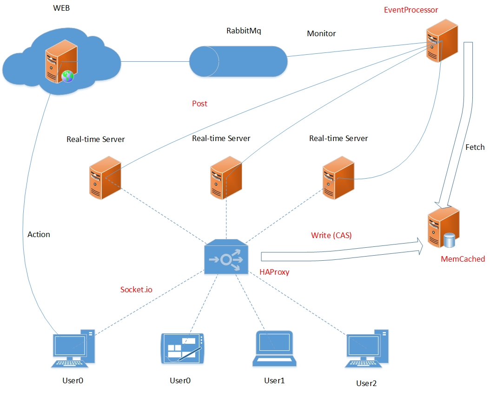

# services-realtime
* A Internship project.
* Java service for Web. 
* Maintain a long conection (websocket/polling) for each Web user. Notify them if a new message arrive without refreshing the page manualy.
* Arch 

* Releated project: [EventProcessor](https://github.com/ZJUZT/EventProcessor).